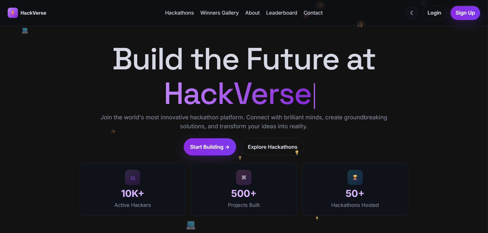
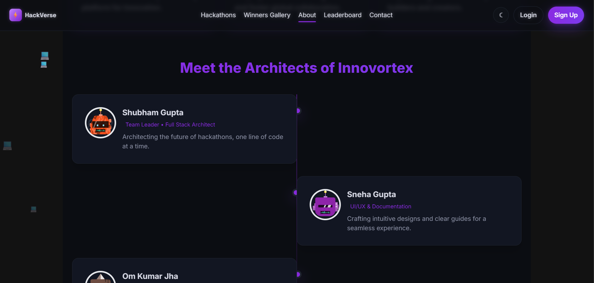
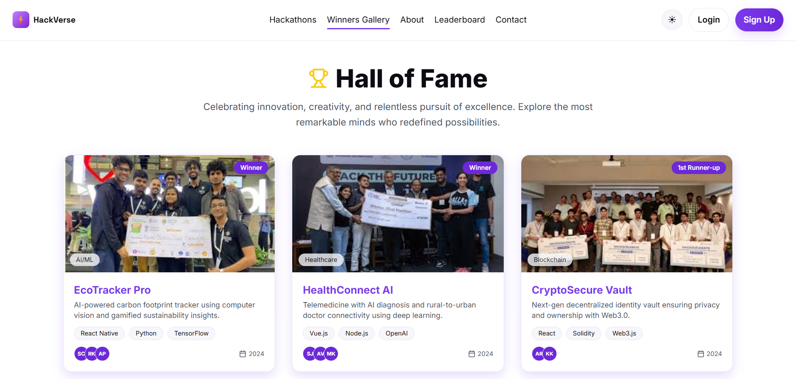
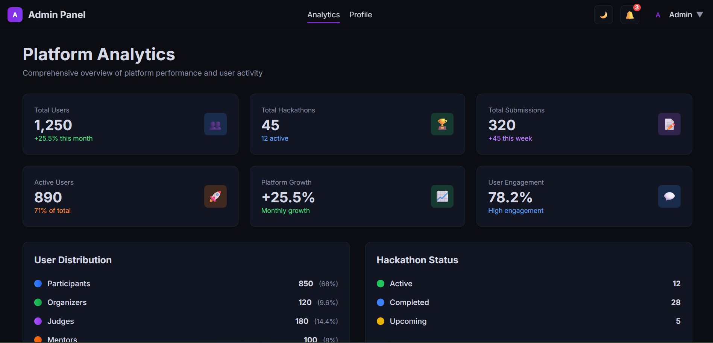
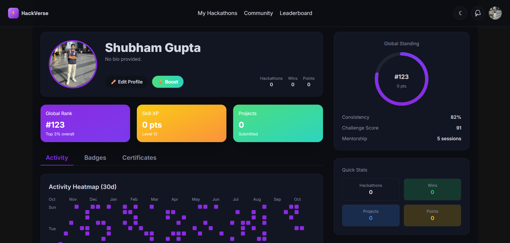

# Innovertex4.0 - Hackathon Management Platform

## Project Overview

Innovertex4.0 is a comprehensive hackathon management platform designed to streamline the entire hackathon lifecycle, from registration and team formation to submission, judging, and winner announcements. It supports multiple user roles, including Participants, Organizers, Judges, Mentors, and Admins, each with tailored dashboards and functionalities.

## Features

### General
*   **User Authentication:** Secure login/signup with traditional email/password and OAuth (Google, GitHub).
*   **Real-time Communication:** Integrated chat and real-time updates using Socket.IO.
*   **Responsive UI:** Modern and responsive user interface built with React and Tailwind CSS.
*   **Theming:** Dark and Light mode support.

### Participant
*   **Hackathon Registration:** Browse and register for active hackathons.
*   **Team Management:** Form or join teams.
*   **Submission:** Submit projects and view submission status.
*   **Leaderboard:** View global and hackathon-specific leaderboards.
*   **Workspace:** Dedicated workspace for team collaboration.
*   **Profile Management:** Update personal information.

### Organizer
*   **Hackathon Creation & Management:** Create, edit, and manage hackathons.
*   **User Management:** Invite and manage Judges, Mentors, and Participants.
*   **Team Assignment:** Assign teams to mentors and judges.
*   **Analytics:** View hackathon and participant analytics.
*   **Announcements:** Send announcements to participants.

### Judge
*   **Submission Evaluation:** Access and evaluate submitted projects based on defined criteria.
*   **Mentorship Overview:** View assigned teams and their progress.
*   **Analytics & Profile:** View personal analytics and manage profile.

### Mentor
*   **Team Mentorship:** Provide guidance and support to assigned teams via chat.
*   **Team Analytics:** Monitor team progress and analytics.
*   **Chat:** Real-time communication with assigned teams.

### Admin
*   **Overall Platform Analytics:** Monitor platform usage and performance.
*   **User & Hackathon Oversight:** Manage all users and hackathons on the platform.

## Technologies Used

### Backend (Node.js, Express)
*   **Framework:** Express.js
*   **Database:** MongoDB (via Mongoose ORM)
*   **Authentication:** `bcryptjs`, `jsonwebtoken`, `passport`, `passport-github2`, `passport-google-oauth20`
*   **Real-time:** `socket.io`
*   **Cloud Storage:** `cloudinary`, `multer`, `multer-storage-cloudinary`
*   **Environment Variables:** `dotenv`
*   **CORS:** `cors`
*   **Session Management:** `express-session`

### Frontend (React.js)
*   **Framework:** React.js
*   **Build Tool:** Vite
*   **Routing:** `react-router-dom`
*   **Styling:** Tailwind CSS, PostCSS, Autoprefixer
*   **Real-time:** `socket.io-client`
*   **Animations:** `framer-motion`, `canvas-confetti`
*   **Icons:** `lucide-react`
*   **3D Graphics (Potential):** `ogl` (observed in dependencies, suggesting advanced UI elements)
*   **State Management:** React Context API (`AuthContext`, `ChatContext`, `SocketContext`)

## Getting Started

### Prerequisites

*   Node.js (v14 or higher)
*   npm or Yarn
*   MongoDB Atlas account (or local MongoDB instance)
*   Cloudinary account (for image uploads)
*   Google and GitHub OAuth credentials (for social login)

### Installation

1.  **Clone the repository:**
    ```bash
    git clone <repository_url>
    cd Innovertex4.0
    ```

2.  **Backend Setup:**
    ```bash
    cd backend
    npm install
    ```
    Create a `.env` file in the `backend` directory with the following environment variables:
    ```
    PORT=5000
    MONGO_URI=<Your MongoDB Connection String>
    JWT_SECRET=<A strong secret for JWT>
    SESSION_SECRET=<A strong secret for Express session>
    CLOUDINARY_CLOUD_NAME=<Your Cloudinary Cloud Name>
    CLOUDINARY_API_KEY=<Your Cloudinary API Key>
    CLOUDINARY_API_SECRET=<Your Cloudinary API Secret>
    GOOGLE_CLIENT_ID=<Your Google OAuth Client ID>
    GOOGLE_CLIENT_SECRET=<Your Google OAuth Client Secret>
    GITHUB_CLIENT_ID=<Your GitHub OAuth Client ID>
    GITHUB_CLIENT_SECRET=<Your GitHub OAuth Client Secret>
    FRONTEND_URL=http://localhost:5173
    ```

3.  **Frontend Setup:**
    ```bash
    cd ../frontend
    npm install
    ```
    The frontend will automatically pick up the `FRONTEND_URL` from the backend's `.env` if not explicitly set in the frontend, but you might want to configure it if running on a different port or domain.

## Running the Application

1.  **Start the Backend Server:**
    ```bash
    cd backend
    npm start
    ```
    The backend server will run on `http://localhost:5000` (or your specified PORT).

2.  **Start the Frontend Development Server:**
    ```bash
    cd frontend
    npm run dev
    ```
    The frontend development server will typically run on `http://localhost:5173`.

## UI Screenshots

Here are some screenshots of the Innovertex4.0 platform:

### Screenshot 1


### Screenshot 2


### Screenshot 3


### Screenshot 4


### Screenshot 5


## Project Structure

```
Innovertex4.0/
├── backend/
│   ├── node_modules/
│   ├── package.json
│   ├── src/
│   │   ├── app.js             # Main entry point for the backend
│   │   ├── config/            # Database connection, Passport setup
│   │   ├── controllers/       # Business logic for various modules
│   │   ├── middleware/        # Authentication middleware
│   │   ├── models/            # Mongoose schemas for data models
│   │   ├── routes/            # API routes
│   │   └── utils/             # Utility functions (Cloudinary, Socket.IO)
│   └── .env                   # Environment variables for backend
├── frontend/
│   ├── node_modules/
│   ├── package.json
│   ├── public/                # Static assets
│   ├── src/
│   │   ├── App.jsx            # Main React component, defines routes
│   │   ├── assets/            # Frontend assets
│   │   ├── components/        # Reusable React components (categorized by role)
│   │   ├── context/           # React Context for global state (Auth, Chat, Socket)
│   │   ├── pages/             # Page-level React components (categorized by role)
│   │   └── utils/             # Frontend utility functions (API calls)
│   ├── tailwind.config.js     # Tailwind CSS configuration
│   ├── vite.config.js         # Vite build configuration
│   └── README.md              # Frontend specific README (optional)
├── README.md                  # Project-wide README (this file)
└── .gitignore
```
